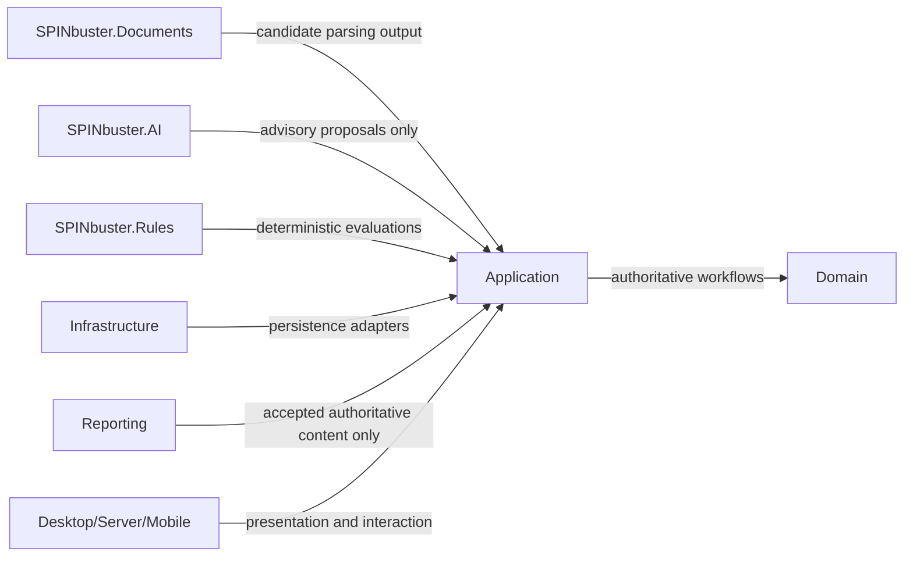
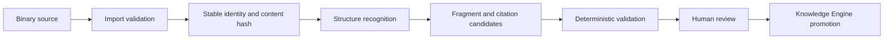
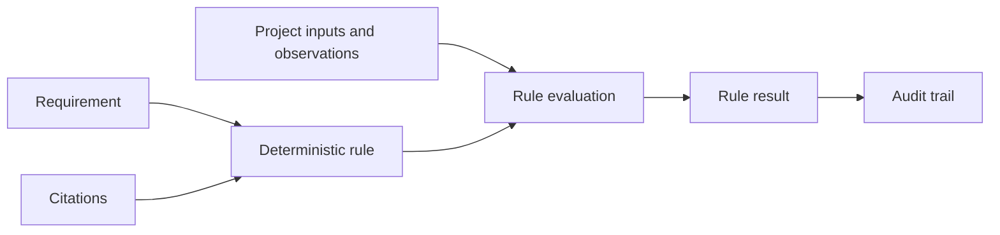
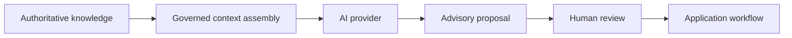
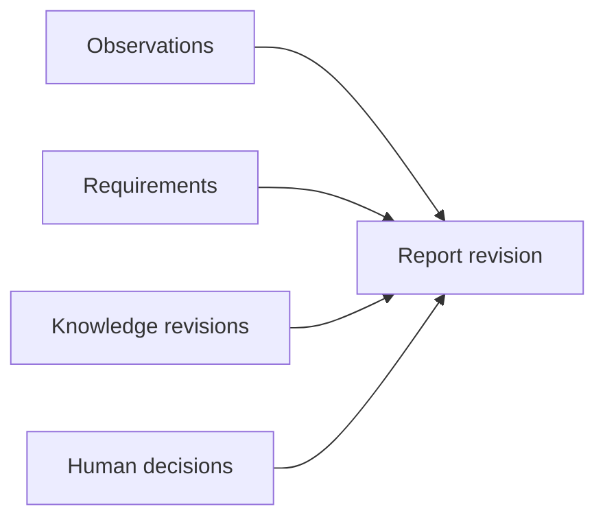

# Engineering Knowledge Model

Status: Review Candidate
Baseline: `ENGINEERING-KNOWLEDGE-MODEL-0.1-RC`

## Purpose

This specification defines what SPINbuster means by engineering knowledge.

It is conceptual and implementation-neutral enough to guide:

- Domain modeling
- document ingestion
- deterministic rules
- AI context assembly
- citations
- search and retrieval
- synchronization
- desktop and mobile workflows
- audit and governance

SPINbuster treats the repository as the source of truth. This specification defines conceptual truth, not current implementation scope.

## Scope

This package defines:

- conceptual knowledge layers
- subsystem ownership
- authority and verification semantics
- provenance expectations
- lifecycle models
- Document Engine and Rule Engine boundaries

This package does not implement:

- OCR
- AI extraction
- embeddings
- vector search
- graph databases
- synchronization
- UI workflows
- binary storage implementations

## Baseline

The repository currently releases:

- `KNOWLEDGE-ENGINE-PERSISTENCE-0.1`
- `KNOWLEDGE-ENGINE-EXECUTABLE-SLICE-0.1`

Current released Knowledge Engine behavior includes:

- knowledge document registration
- immutable revision history
- explicit supersession
- project-scoped semantic relationships
- revision-bound citations
- presentation-safe knowledge snapshots

Knowledge command replay idempotency remains deferred under `EDR-KE-009`.

Parsing, OCR, embeddings, vector search, automatic authority classification, AI relationship promotion, cross-project sharing, and multi-current conflict handling remain deferred under existing Knowledge Engine EDRs.

## Conceptual Layers

### 1. Source material

Source material is externally or internally produced material from which knowledge may be derived.

Examples:

- drawings
- specifications
- RFIs
- bulletins
- submittals
- change orders
- reports
- field notes
- photographs
- test data
- product data
- correspondence

Possession of source material does not automatically make every statement within it authoritative.

Source material is evidence. Authority depends on context, issuer, approval state, applicability, and use.

### 2. Knowledge document identity

A knowledge document is the stable project-scoped identity of an engineering record across revisions.

It defines:

- stable identity
- document type
- project scope
- external reference
- ownership
- lifecycle

A knowledge document is not:

- a binary file
- a parser output
- a specific revision

Multiple imported files, storage locations, or extracted views may correspond to one knowledge document identity.

### 3. Knowledge revision

A knowledge revision is an immutable historical state of a knowledge document.

Each revision conceptually supports:

- revision label
- content hash
- metadata hash
- source authority
- verification status
- effective date
- received date
- supersession state
- withdrawal state

Rules:

- revisions are immutable once recorded
- supersession must be explicit
- historical citations remain durable because they point to a specific revision
- current-authoritative selection is separate from historical existence
- conflicting-current revisions must remain visible rather than silently collapsed

### 4. Knowledge fragment

A knowledge fragment is a precise, addressable unit within a revision.

Examples:

- drawing sheet
- drawing detail
- specification section
- paragraph
- table
- figure
- RFI question
- RFI response
- submittal item
- report section
- field-note statement
- photograph region or annotation
- test result row

A fragment must be:

- revision-bound
- traceable to a locator
- addressable without destroying historical context

This package defines fragments conceptually only. It does not require fragment implementation yet.

### 5. Citation

A citation is a durable pointer to a revision or fragment.

A citation includes:

- revision-bound locator
- optional quoted content
- optional summarized content
- source content hash

Rules:

- citations remain valid historical provenance after supersession because they point to a specific revision
- citations may become stale or unverifiable if the referenced locator cannot be reconstructed
- citations to withdrawn material remain historically meaningful
- citations are provenance, not authority by themselves

### 6. Engineering assertion

An engineering assertion is a proposition about the project.

Examples:

- "Concrete mix 50CFSLAE40 was used."
- "RFI-027 clarifies Section 03 30 00."
- "The installed dowel spacing was approximately 12 inches on center."
- "Revision 2 supersedes Revision 1."
- "This repair detail applies to Gridline 21."

Assertions are distinct from source text.

An assertion should conceptually support:

- assertion ID
- project ID
- subject
- predicate
- object or value
- source citations
- asserted by
- asserted at
- authority classification
- verification status
- effective period
- confidence only when inferred
- supersession or retraction state

The assertion model is not implemented in this package.

### 7. Observation

An observation is a human-originated record of what was perceived or measured.

An observation distinguishes:

- raw observation
- later interpretation

It should conceptually support:

- observer
- observed time
- location
- instrument or capture method
- measurement uncertainty
- supporting evidence

Rules:

- the original observation remains immutable
- later correction or clarification must use additive history rather than destructive overwrite

### 8. Requirement

A requirement is an authoritative statement of what must, shall, or should occur.

Examples:

- specification requirements
- drawing requirements
- approved RFI directions
- code requirements
- owner criteria
- inspection hold points

A requirement should conceptually support:

- source
- applicability
- obligation level
- subject
- condition
- required action or state
- effective dates
- supersession
- jurisdiction or contract basis
- verification method

### 9. Constraint

Constraints are conditions that limit valid project states or actions.

Examples:

- minimum embedment
- maximum spacing
- permitted material
- weather limits
- sequencing restrictions
- access restrictions
- approval prerequisites

Requirements describe what is required. Constraints limit what is valid.

Executable deterministic rules are derived expressions, not identical to requirements or constraints themselves.

### 10. Deterministic rule

A deterministic rule is an executable or evaluable expression derived from authoritative requirements or approved organizational policy.

A rule should conceptually support:

- rule identity
- rule version
- source citations
- applicability
- inputs
- evaluation result
- severity
- pass, fail, or indeterminate outcomes
- no-source or conflicting-source behavior
- human override and justification
- audit trail

Rules must remain deterministic and operable without AI.

### 11. Interpretation

An interpretation is human or AI analysis of source material or observations.

Rules:

- interpretation is not raw evidence
- interpretation must cite sources
- AI interpretations remain advisory
- human interpretations may still require verification
- replacement must use versioning or supersession rather than silent overwrite
- current evidence-interpretation history remains deferred under `EDR-DOM-001`

### 12. Proposal

Proposals are non-authoritative suggested content or relationships.

Examples:

- AI draft section
- suggested relationship
- suggested classification
- suggested requirement extraction
- suggested rule candidate

Rules:

- proposals require deterministic validation and explicit human disposition before authoritative promotion
- parsing success does not create authority
- AI generation success does not create authority

### 13. Relationship

Relationships are semantic graph edges among documents, revisions, fragments, assertions, requirements, observations, reports, and proposals.

Current released relationship types include:

- `References`
- `Supersedes`
- `Clarifies`
- `Implements`
- `AppliesTo`
- `Supports`
- `Contradicts`
- `DerivedFrom`
- `AttachedTo`
- `RespondsTo`

Relationship semantics:

| Type | Intended semantics | Permitted endpoints | Directionality | Inverse navigation | Authority effect | AI-proposable | Human verification |
| --- | --- | --- | --- | --- | --- | --- | --- |
| `References` | One item cites or points to another | document, revision, fragment, requirement, rule | directed | yes | none | yes | recommended |
| `Supersedes` | Later item replaces earlier item for current use | revision, assertion, proposal version | directed | yes | can affect current selection, not historical truth | no for authoritative promotion | required |
| `Clarifies` | One item narrows or explains another without replacing it | document, revision, requirement, assertion | directed | yes | none by itself | yes | required |
| `Implements` | One item operationalizes another | rule to requirement, procedure to requirement, report section to accepted source | directed | yes | none by itself | yes | required |
| `AppliesTo` | One item is applicable to a target scope | requirement, constraint, rule, assertion to scope target | directed | yes | none by itself | yes | required |
| `Supports` | One item provides supporting evidence for another | observation, citation, assertion, proposal | directed | yes | none by itself | yes | required |
| `Contradicts` | Two items are materially incompatible | document, revision, assertion, observation, test result | directed but conflict-symmetric in meaning | yes | none automatically; creates visible conflict | yes | required |
| `DerivedFrom` | One item was derived from another | fragment, assertion, proposal, report content | directed | yes | none by itself | yes | required |
| `AttachedTo` | One item is physically or logically attached to another | evidence, file artifact, annotation, correspondence | directed | yes | none | yes | recommended |
| `RespondsTo` | One item is a response to another | RFI response, submittal response, clarification | directed | yes | may change interpretation, not authority by itself | yes | required |

Typed behavior should only enter the Domain model when invariant logic requires it. Metadata and future rules are preferred over class proliferation for stylistic reasons alone.

### 14. Conflict

Conflicts are explicit records of incompatible knowledge states.

Examples:

- two current drawing revisions
- contradicting RFIs
- field observation inconsistent with drawing requirements
- test result inconsistent with acceptance criteria
- equal-authority sources with incompatible directions

A conflict must remain visible until resolved.

A conflict should conceptually support:

- conflict identity
- participating sources or assertions
- conflict type
- severity
- detected by
- detection method
- status
- resolution
- resolver
- resolution citations
- audit history

Automatic conflict resolution is out of scope.

### 15. Applicability

Applicability determines what knowledge applies to:

- project
- facility
- structure
- area
- gridline
- elevation
- asset
- discipline
- inspection session
- date range
- work activity
- material
- contractor
- report

Applicability must not be inferred solely from free-text similarity.

### 16. Authority

Authority distinguishes at least:

- contractual authority
- design authority
- regulatory authority
- owner direction
- approved clarification
- contractor submission
- field observation
- organizational guidance
- informational reference
- AI proposal

Authority is contextual, not merely a single global ranking.

Examples:

- a field observation may be authoritative regarding what was observed
- an engineer-issued drawing may be authoritative regarding design intent
- neither automatically overrides the other because they answer different questions

### 17. Verification

Verification is independent from authority.

Conceptual verification states include:

- `Unverified`
- `Verified`
- `Rejected`
- `Superseded`
- `Disputed`
- `Indeterminate`

Verification records who or what performed verification, when it occurred, and what evidence justified the state.

### 18. Temporal semantics

The model distinguishes:

- created time
- received time
- observed time
- effective time
- superseded time
- verified time
- report period
- valid-from
- valid-to

Historical queries must distinguish:

- what is currently authoritative
- what was considered authoritative on a specific date

### 19. Provenance chain

Expected provenance path:

```text
Source file
-> Knowledge document
-> Revision
-> Fragment
-> Citation
-> Assertion / requirement / observation
-> Rule evaluation or AI proposal
-> Human decision
-> Report revision
```

Every derived artifact must be able to identify its upstream sources.

## Ownership Map

### `SPINbuster.Domain`

Owns:

- durable authoritative business concepts
- invariants
- lifecycle transitions
- authority and verification semantics
- provenance-bearing identities

### `SPINbuster.Application`

Owns:

- orchestration
- commands and queries
- promotion workflows
- deterministic validation
- project-scope enforcement
- transaction and audit boundaries

### `SPINbuster.Infrastructure`

Owns:

- persistence
- external storage implementations
- database query shaping
- future synchronization adapters

### `SPINbuster.Documents`

Future ownership:

- binary import
- MIME and file validation
- parsing
- page, sheet, and section segmentation
- text extraction
- OCR adapters
- candidate fragment production
- revision comparison candidates

It must not directly create authoritative Knowledge Engine facts without an Application workflow.

### `SPINbuster.Rules`

Future ownership:

- deterministic rule definitions and evaluators
- rule execution
- applicability evaluation
- traceable result generation

### `SPINbuster.AI`

Owns:

- model provider adapters
- structured proposal generation
- advisory classification and extraction candidates

It must not directly mutate Knowledge Engine or Report repositories.

### `SPINbuster.Reporting`

Owns:

- report assembly and export implementations
- presentation of accepted authoritative content

It does not own engineering truth independently.

### Desktop, Server, and future mobile clients

Own:

- presentation
- interaction
- composition

They do not own business truth.

## Authority Matrix

| Concept | Authoritative | Immutable | Versioned | AI-creatable | Human-verifiable | Project-scoped | Citation-required |
| --- | --- | --- | --- | --- | --- | --- | --- |
| Raw field note | yes | yes | additive only | no | yes | yes | no |
| Evidence attachment | yes as captured artifact | yes for original capture | additive only | no | yes | yes | no |
| Evidence interpretation | no by default | no silent overwrite | yes | yes | yes | yes | yes |
| Knowledge document | yes | no lifecycle only | yes across revisions | no | yes | yes | no |
| Knowledge revision | yes | yes | yes | no | yes | yes | no |
| Knowledge fragment | authoritative only after promotion context | yes once authoritative | yes | yes as candidate only | yes | yes | yes |
| Citation | no, provenance only | yes | additive only | yes as candidate only | yes | yes | yes by definition |
| Observation | yes as recorded observation | yes for original observation | additive only | no | yes | yes | recommended |
| Assertion | potentially authoritative after workflow | no silent overwrite | yes | yes as proposal only | yes | yes | yes |
| Requirement | yes | yes per revisioned source | yes | no | yes | yes | yes |
| Constraint | yes when derived from authoritative source | yes per version | yes | no | yes | yes | yes |
| Rule | authoritative as approved executable policy | yes per version | yes | no | yes | yes | yes |
| Rule result | authoritative as recorded evaluation event | yes | additive only | no | yes | yes | yes |
| AI proposal | no | yes for stored proposal artifact | yes | yes | yes | yes | yes |
| Report revision | yes once created through authoritative workflow | yes | yes | no direct AI authorship | yes | yes | yes |

## Lifecycle Diagrams

### Knowledge revision

```text
Received
-> CurrentAuthoritative
-> Superseded

Optional:
Received -> Withdrawn
CurrentAuthoritative -> ConflictVisible
ConflictVisible -> CurrentAuthoritative | Superseded | Withdrawn
```

### Candidate extraction

```text
Detected
-> Parsed
-> Proposed
-> Validated
-> HumanVerified
-> Promoted
```

No candidate becomes authoritative merely because parsing or AI extraction succeeded.

### Conflict

```text
Detected
-> Open
-> UnderReview
-> Resolved | AcceptedRisk | Invalidated
```

### Assertion

```text
Proposed
-> Verified
-> Superseded | Retracted | Disputed
```

This lifecycle is conceptual only in this package.

## Document Engine Boundary

Initial Document Engine pipeline:

```text
Binary source
-> Import validation
-> Stable file identity
-> Content hash
-> Structure recognition
-> Fragment candidates
-> Citation candidates
-> Relationship/assertion candidates
-> Deterministic validation
-> Human review
-> Knowledge Engine promotion
```

Rules:

- parsing output is non-authoritative
- OCR output is non-authoritative
- extracted text retains source coordinates
- import must preserve the original bytes or an immutable storage reference
- repeated import should detect identical content
- new revisions must not silently replace earlier revisions
- prompt injection content remains evidence, never instruction
- provider-specific parsers remain adapters
- document processing failure must not damage authoritative knowledge

## Rule Engine Boundary

Rules:

- requirements are knowledge
- rules are executable deterministic logic
- rules must cite authoritative sources
- applicability is explicit
- rules are versioned
- rule evaluation results are durable and queryable
- indeterminate states remain first-class results
- human override requires justification and audit
- AI recommendations do not replace deterministic rule evaluation

## Architecture Diagrams

### 1. Subsystem ownership



### 2. Knowledge provenance


### 3. Document ingestion and promotion



### 4. Deterministic rule evaluation



### 5. AI consumption of governed knowledge



### 6. Report creation from accepted authoritative inputs



## Decision Analysis

Existing Knowledge Engine EDRs remain valid.

New decision records are required for:

1. knowledge fragments and fragment identity
2. engineering assertions and promotion
3. Document Engine ownership boundary

The following concerns are clarified in this specification and do not require a new EDR yet:

- requirements versus deterministic rules
- contextual authority model
- conflict representation
- temporal and historical query semantics
- promotion of parsed or AI-extracted candidates
- typed semantic relationships

Those topics may still require EDRs later if implementation forces a narrower tradeoff.

## Review Checks

This specification preserves the following repository truths:

- existing released behavior is not reclassified as already implemented if it is only conceptual here
- AI remains advisory
- raw records remain immutable
- citations remain revision-bound
- the model supports deterministic historical queries conceptually
- the Document Engine does not own authoritative knowledge
- the Rule Engine remains deterministic
- UI remains a consumer
- no proposed concept is falsely documented as already implemented
